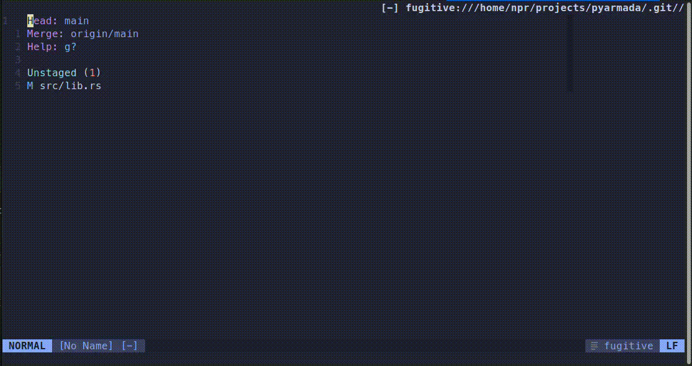

# telescope-cc.nvim

A Telescope integration of [Conventional Commits](https://www.conventionalcommits.org/).



## Installation

```
# vim-plug
Plug 'olacin/telescope-cc.nvim'

# packer
use 'olacin/telescope-cc.nvim'
```

## Usage

```
# As a command
:Telescope conventional_commits

# As a lua function
require('telescope').extensions.conventional_commits.conventional_commits()
```

## Configuration

You can customize action on selection within Telescope `setup()` function.

```lua
telescope.setup({
    ...
    extensions = {
        conventional_commits = {
            action = function(entry)
                -- entry = {
                --     display = "feat       A new feature",
                --     index = 7,
                --     ordinal = "feat",
                --     value = feat"
                -- }
                print(vim.inspect(entry))
            end,
        },
    },
})

telescope.load_extension("conventional_commits")
```

### Default action

```lua
local cc_actions = {}

cc_actions.commit = function(t, scope, msg)
    local cmd = ""
    local commit_message = t

    if scope then
        commit_message = commit_message .. string.format("(%s)", scope)
    end
    commit_message = string.format("%s: %s", commit_message, msg)

    if vim.g.loaded_fugitive then
        cmd = string.format(':G commit -m "%s"', commit_message)
    else
        cmd = string.format(':!git commit -m "%s"', commit_message)
    end

    vim.cmd(cmd)
end

-- Default action (here with tpope vim-fugitive)
cc_actions.prompt = function(entry)
    vim.ui.input({ prompt = "Is there a scope ? (optional)" }, function(msg)
        local scope = msg
        vim.ui.input({ prompt = "Enter commit message: " }, function(msg)
            if not msg then
                return
            end
            cc_actions.commit(entry.value, scope, msg)
        end)
    end)
end
```
